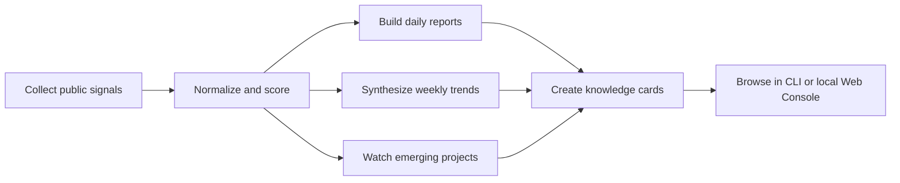

# AgentRadar

An open-source trend radar and research workbench for the AI agent ecosystem.

English · [中文](./README.md)


> Collect public signals, score momentum, and turn ecosystem movement into reusable research artifacts.

> **Try the hosted app**
>
> Visit [app.agentradar.top](https://app.agentradar.top/) to browse the online version directly. The hosted site supports login, which is useful if you want to inspect outputs before running anything locally.

---

## What this is

AgentRadar continuously collects public signals from the AI agent ecosystem, normalizes them, scores projects, synthesizes weekly trends, builds knowledge cards, and turns everything into a local artifact set that is easy to browse, verify, and reuse.

Think of it as an open-source radar system for researchers, developers, investors, product teams, and agent builders:

- It is not a chatbot. It is a repeatable data and analysis workflow.
- It is not a black-box recommendation engine. It tries to preserve evidence, score components, and trend reasoning.
- It does not only track one-day heat. It also tracks persistence, week-level movement, and emerging directions.

If you often ask questions like these, this project is for you:

- Which agent projects are worth looking at today?
- Which repositories are only one-day hype, and which are building momentum?
- What directions actually formed into trends this week?
- Which emerging projects are worth watching before they reach the main board?
- Why did a project rank highly, and what evidence supports that?

## Online access

<table>
  <tr>
    <td width="50%">
      <strong>🌐 Browse online</strong><br/>
      Open <a href="https://app.agentradar.top/">app.agentradar.top</a> to jump straight into the homepage, project library, weekly trends, and observer views.
    </td>
    <td width="50%">
      <strong>🔐 Account support</strong><br/>
      The hosted version supports login. This repository mostly documents the open workflow and local artifact system.
    </td>
  </tr>
  <tr>
    <td>
      <strong>Best for</strong><br/>
      Readers who want to inspect value first and decide on local setup later
    </td>
    <td>
      <strong>Planned next</strong><br/>
      Implicit personalized memory built from user behavior in the hosted product
    </td>
  </tr>
</table>

## Why it matters

Many projects can scrape `GitHub Trending` once. The harder part comes after that:

- How do you align signals from different sources?
- How do you balance same-day heat with longer-term persistence?
- How do you turn “this feels hot” into an interpretable trend judgment?
- How do you notice promising projects before they become obvious?

AgentRadar connects those steps into one workflow and stores the results as inspectable daily and weekly artifacts instead of stopping at a subjective take.

## What you get

> `Collect → Score → Synthesize → Archive → Reuse`

### 1. Daily trend board

- `data/reports/YYYY-MM-DD.daily.json`
- `data/reports/YYYY-MM-DD.daily.md`
- `data/reports/YYYY-MM-DD.run-summary.json`
- `data/reports/YYYY-MM-DD.verify-daily.json`

### 2. Weekly trend synthesis

- `data/reports/YYYY-MM-DD.weekly.json`
- `data/reports/YYYY-MM-DD.weekly.md`
- `data/reports/YYYY-MM-DD.weekly.judgment.json`
- `data/reports/YYYY-MM-DD.weekly.audit.json`

### 3. Knowledge cards

- `data/kb/latest.json`
- `data/kb/*.md`

### 4. Emerging-project observer

- `data/observer/ecosystem-focus/*.json`

### 5. Local read-only workbench

The repository includes a lightweight local read-only web console for browsing generated artifacts.

### 6. Hosted online app

- Hosted URL: [`https://app.agentradar.top/`](https://app.agentradar.top/)
- Browse the homepage, project library, weekly trends, run health, and emerging-project views directly
- Supports login
- Implicit personalized memory based on user behavior is part of the next hosted-product direction

`🔄 daily refresh` · `↗ weekly judgment` · `◎ emerging watch` · `▣ knowledge archive`


## How to read this repository

<table>
  <tr>
    <td width="33%">
      <strong>📈 Trend view</strong><br/>
      Use the board, scores, and summaries to understand what changed today.
    </td>
    <td width="33%">
      <strong>🧭 Research view</strong><br/>
      Use weekly reports and judgments to separate real movement from short-lived spikes.
    </td>
    <td width="33%">
      <strong>🗂️ Archive view</strong><br/>
      Use knowledge cards and the observer pool for long-term tracking and review.
    </td>
  </tr>
  <tr>
    <td>
      <strong>Start with</strong><br/>
      <code>daily.md</code> / <code>run-summary.json</code>
    </td>
    <td>
      <strong>Start with</strong><br/>
      <code>weekly.md</code> / <code>weekly.judgment.json</code>
    </td>
    <td>
      <strong>Start with</strong><br/>
      <code>data/kb/</code> / <code>data/observer/</code>
    </td>
  </tr>
</table>

## What the agents inside the system do

AgentRadar is not “one all-purpose agent.” It is a set of scoped agents and workflows that work together to turn public signals into readable, verifiable, reusable trend artifacts.

<table>
  <tr>
    <td width="25%">
      <strong>📡 Signal Collection Agent</strong><br/>
      Pulls raw signals from public sources, handles basic source differences, and writes into <code>data/raw/</code>.
    </td>
    <td width="25%">
      <strong>⚖️ Normalization &amp; Scoring Agent</strong><br/>
      Converts mixed-source inputs into a unified structure, fills scoring fields, and produces interpretable ranking outputs.
    </td>
    <td width="25%">
      <strong>🗞️ Daily Report Agent</strong><br/>
      Produces the daily board, project summaries, recommendation reasons, risk notes, and run summaries.
    </td>
    <td width="25%">
      <strong>📈 Weekly Trend Agent</strong><br/>
      Reviews a 7-day window of topic movement to separate durable trends from short-lived spikes.
    </td>
  </tr>
  <tr>
    <td>
      <strong>🔭 Observer Agent</strong><br/>
      Watches for promising repositories that are still early and not yet strong enough for the main board.
    </td>
    <td>
      <strong>🧠 Knowledge Card Agent</strong><br/>
      Turns high-value projects into reusable cards for later indexing, review, and long-term research.
    </td>
    <td>
      <strong>🧵 Agent Memory Workflow</strong><br/>
      Stores part of the development and workflow context so the system itself is easier to evolve over time.
    </td>
    <td>
      <strong>🔄 How they work together</strong><br/>
      The pipeline moves from collection to scoring, then into daily reports, weekly synthesis, observer tracking, and knowledge-card archival.
    </td>
  </tr>
</table>

### Special note: the weekly trend agent

The weekly trend agent is one of the most important layers in the project. It does more than stitch together seven days of data. It is trying to answer research-grade questions like:

- Which directions are only one-day heat, and which are becoming durable trends?
- Which projects should stay in a trend cluster, and which should be downgraded, merged, or split?
- Which evidence is strong enough to support the conclusion that a real weekly shift happened?

If the daily board answers “what changed today,” the weekly trend agent is much closer to answering “what actually changed this week.”

## Workflow at a glance



In practice, the workflow pushes data from `data/raw/` into `data/scores/`, `data/reports/`, `data/observer/`, and `data/kb/`, so the repository works both as a local research tool and as a repeatable artifact generator.

## Who it is for

- Researchers tracking movement in the AI agent ecosystem
- Developers or product teams doing project watch, directional analysis, and ecosystem scanning
- Builders who want structured artifacts from public signals
- Teams adapting the current rules and sources into their own internal radar workflow

## Quick start

### 1. Install dependencies

```bash
corepack pnpm install
```

### 2. Prepare environment variables

```bash
cp .env.example .env
```

Notes:

- If you only want to browse committed artifacts, you may not need any provider key.
- If you want LLM-enhanced workflows, add the provider keys you need.

### 3. Start the local web console

```bash
corepack pnpm visual-console:web
```

Default address:

- `http://127.0.0.1:3210`

### 4. Use the CLI view directly

```bash
corepack pnpm visual-console -- --view overview --date latest
```

### 5. Or use the hosted site directly

- Hosted URL: [`https://app.agentradar.top/`](https://app.agentradar.top/)
- Best when you want to inspect outputs before deciding on local setup or deeper customization

## Suggested reading path

> **If you only want to inspect outputs**
>
> Open the local web console or browse `data/reports/latest.*` first. You can understand the repository's daily outputs in a few minutes.

> **If you want to run the pipeline once**
>
> A good order is `run-daily -> verify-daily -> run-weekly`. That gives you generation, validation, and then a higher-level synthesis.

> **If you want to adapt it into your own radar**
>
> Start with `config.yaml` and source rules before changing every workflow. The repository is easier to extend incrementally than to rewrite in one pass.

`→ inspect first` `→ run next` `→ customize after`

`signal agent → scoring agent → daily agent → weekly trend agent → observer / kb`

## Common commands

### Daily workflows

```bash
corepack pnpm run-daily
corepack pnpm verify-daily
corepack pnpm score
```

### Weekly workflows

```bash
corepack pnpm run-weekly
corepack pnpm sync-weekly
```

### Other

```bash
corepack pnpm capture-github-stars
corepack pnpm build-kb
corepack pnpm typecheck
corepack pnpm test
```

## Data boundary

### Current focus directions

`◌ signals` `◌ momentum` `◌ trend` `◌ observer` `◌ archive`

- coding agents
- agent runtime
- skills / tools / MCP
- memory / knowledge
- browser / computer use
- eval / observability / governance
- multi-agent coordination
- agent UI / workbench

These directions come from repository rules and configuration, not vague prompt-only intuition.

### OSS boundary

To avoid exposing secrets, configuration, and private attack surfaces, the OSS edition explicitly excludes:

- login
- registration
- OAuth
- session / account settings
- local auth bootstrap
- private deployment templates
- private operational docs
- `.env` / `.env.local`

In other words, the repository's OSS edition is a no-login, read-only browsing, data-workflow-capable public edition.

### Hosted-product note

- The hosted site lives at [`app.agentradar.top`](https://app.agentradar.top/)
- The hosted site supports login, so it has a different product boundary from the repository's local read-only console
- Planned hosted features include implicit personalized memory generated from reading, clicking, and follow behavior

## Contributing

This project benefits heavily from the open-source community and public data sources. Special thanks to:

- [agents-radar](https://github.com/duanyytop/agents-radar)
- [Trendshift](https://trendshift.io)
- [GitHub](https://github.com)
- the broader ecosystem of open-source agent builders and maintainers

Ways to contribute:

`fork → adjust rules → generate artifacts → open PR`

- open issues for bugs
- open PRs for README, rules, data sources, and workflows
- suggest new observation dimensions or ecosystem directions

If AgentRadar helps you, please consider giving it a Star and sharing it with others working on agent ecosystems, trend research, and open-source intelligence workflows.
