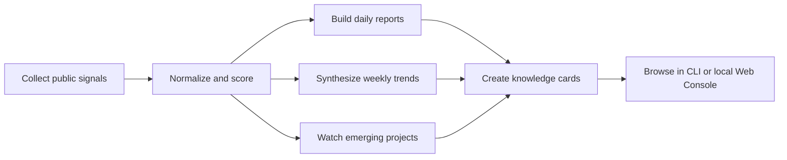

# AgentRadar

An open-source trend radar and research workbench for the AI agent ecosystem.

English · [中文](./README.md)


> Collect public signals, score momentum, and turn ecosystem movement into reusable research artifacts.

---

## What this is

AgentRadar continuously collects public signals from the AI agent ecosystem, normalizes them, scores projects, synthesizes weekly trends, builds knowledge cards, and turns everything into a local artifact set that is easy to browse, verify, and reuse.

Think of it as an open-source radar system for researchers, developers, investors, product teams, and agent builders:

- It is not a chatbot. It is a repeatable data and analysis workflow.
- It is not a black-box recommendation engine. It tries to preserve evidence, score components, and trend reasoning.
- It does not only track one-day heat. It also tracks persistence, week-level movement, and emerging directions.

If you often ask questions like these, this project is for you:

- Which agent projects are worth looking at today?
- Which repositories are only one-day hype, and which are building momentum?
- What directions actually formed into trends this week?
- Which emerging projects are worth watching before they reach the main board?
- Why did a project rank highly, and what evidence supports that?

## Why it matters

Many projects can scrape `GitHub Trending` once. The harder part comes after that:

- How do you align signals from different sources?
- How do you balance same-day heat with longer-term persistence?
- How do you turn “this feels hot” into an interpretable trend judgment?
- How do you notice promising projects before they become obvious?

AgentRadar connects those steps into one workflow and stores the results as inspectable daily and weekly artifacts instead of stopping at a subjective take.

## What you get

### 1. Daily trend board

- `data/reports/YYYY-MM-DD.daily.json`
- `data/reports/YYYY-MM-DD.daily.md`
- `data/reports/YYYY-MM-DD.run-summary.json`
- `data/reports/YYYY-MM-DD.verify-daily.json`

### 2. Weekly trend synthesis

- `data/reports/YYYY-MM-DD.weekly.json`
- `data/reports/YYYY-MM-DD.weekly.md`
- `data/reports/YYYY-MM-DD.weekly.judgment.json`
- `data/reports/YYYY-MM-DD.weekly.audit.json`

### 3. Knowledge cards

- `data/kb/latest.json`
- `data/kb/*.md`

### 4. Emerging-project observer

- `data/observer/ecosystem-focus/*.json`

### 5. Local read-only workbench

The OSS edition includes a lightweight local web console for browsing generated artifacts, but it does not include login, registration, sessions, or account management.

## Workflow at a glance



In practice, the workflow pushes data from `data/raw/` into `data/scores/`, `data/reports/`, `data/observer/`, and `data/kb/`, so the repository works both as a local research tool and as a repeatable artifact generator.

## Who it is for

- Researchers tracking movement in the AI agent ecosystem
- Developers or product teams doing project watch, directional analysis, and ecosystem scanning
- Builders who want structured artifacts from public signals
- Teams adapting the current rules and sources into their own internal radar workflow

## Quick start

### 1. Install dependencies

```bash
corepack pnpm install
```

### 2. Prepare environment variables

```bash
cp .env.example .env
```

Notes:

- If you only want to browse committed artifacts, you may not need any provider key.
- If you want LLM-enhanced workflows, add the provider keys you need.

### 3. Start the local web console

```bash
corepack pnpm visual-console:web
```

Default address:

- `http://127.0.0.1:3210`

### 4. Use the CLI view directly

```bash
corepack pnpm visual-console -- --view overview --date latest
```

## Common commands

### Daily workflows

```bash
corepack pnpm run-daily
corepack pnpm verify-daily
corepack pnpm score
```

### Weekly workflows

```bash
corepack pnpm run-weekly
corepack pnpm sync-weekly
```

### Other

```bash
corepack pnpm capture-github-stars
corepack pnpm build-kb
corepack pnpm typecheck
corepack pnpm test
```

## Data boundary

### Current focus directions

- coding agents
- agent runtime
- skills / tools / MCP
- memory / knowledge
- browser / computer use
- eval / observability / governance
- multi-agent coordination
- agent UI / workbench

These directions come from repository rules and configuration, not vague prompt-only intuition.

### OSS boundary

To avoid exposing secrets, configuration, and private attack surfaces, the OSS edition explicitly excludes:

- login
- registration
- OAuth
- session / account settings
- local auth bootstrap
- private deployment templates
- private operational docs
- `.env` / `.env.local`

In other words, this is a no-login, read-only browsing, data-workflow-capable public edition.

## Contributing

This project benefits heavily from the open-source community and public data sources. Special thanks to:

- [agents-radar](https://github.com/duanyytop/agents-radar)
- [Trendshift](https://trendshift.io)
- [GitHub](https://github.com)
- the broader ecosystem of open-source agent builders and maintainers

Ways to contribute:

- open issues for bugs
- open PRs for README, rules, data sources, and workflows
- suggest new observation dimensions or ecosystem directions

If AgentRadar helps you, please consider giving it a Star and sharing it with others working on agent ecosystems, trend research, and open-source intelligence workflows.
