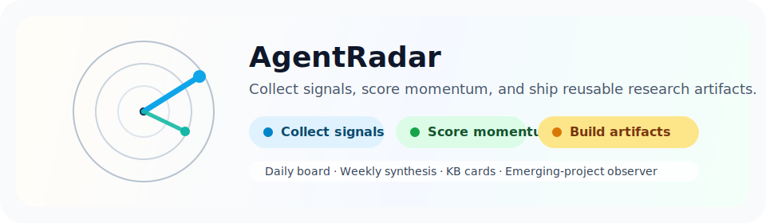
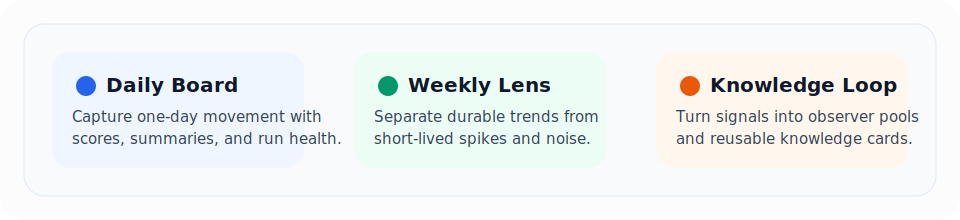
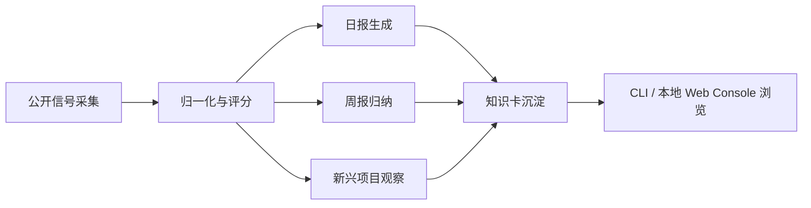

# AgentRadar

面向 AI Agent 生态的开源趋势雷达与研究工作台。

[English](./README.en.md) · 中文




> 从公开信号里抓变化，从周级趋势里看方向，从可复用产物里做研究。

> **直接在线体验**
>
> 访问 [app.agentradar.top](https://app.agentradar.top/) 可以直接查看在线版本；线上站点支持登录，适合不想先在本地跑流程的读者。

---

## 这是什么

AgentRadar 会持续采集 AI Agent 生态里的公开信号，做归一化、评分、周趋势归纳、知识卡沉淀和新兴项目观察，最后把结果整理成一套本地可浏览、可验证、可复用的研究产物。

你可以把它理解成一套开源版的 Agent 生态雷达系统，适合研究者、开发者、投资人、产品团队和 Agent Builder：

- 它不是聊天机器人，而是一条可重复运行的数据与分析流水线。
- 它不是黑盒推荐，而是尽量保留证据链、评分拆解和趋势判断依据。
- 它不只看单日热度，也看持续性、周级移动和新方向浮现。

如果你经常会问这些问题，这个项目就是为你准备的：

- 今天有哪些 Agent 项目值得看？
- 哪些仓库只是一日热度，哪些在持续抬头？
- 本周真正成形的趋势方向是什么？
- 哪些还没进主榜的新项目值得提前盯住？
- 某个项目为什么排得高，背后的证据是什么？

## 在线入口

<table>
  <tr>
    <td width="50%">
      <strong>🌐 在线查看</strong><br/>
      直接打开 <a href="https://app.agentradar.top/">app.agentradar.top</a>，无需先理解仓库结构，就能先看首页、项目库、周趋势和新兴项目观察。
    </td>
    <td width="50%">
      <strong>🔐 账号能力</strong><br/>
      线上托管版支持登录。仓库里的开源文档主要描述数据工作流本身，线上产品能力会继续迭代。
    </td>
  </tr>
  <tr>
    <td>
      <strong>适合谁</strong><br/>
      先看结果、先验证价值、先转发给团队的人
    </td>
    <td>
      <strong>后续方向</strong><br/>
      基于用户行为的隐式个性化记忆能力将逐步加入在线版本
    </td>
  </tr>
</table>

## 为什么值得关注

很多项目都能抓一次 `GitHub Trending`，但真正困难的是后半段：

- 怎么把不同来源的信号对齐成同一种语言？
- 怎么同时看当天热度和长期持续性？
- 怎么把“感觉很火”变成可解释、可复核的趋势判断？
- 怎么在项目爆发前，就把它放进观察池？

AgentRadar 把这些步骤连成一套完整工作流，并把结果沉淀成每天、每周都能复查的产物，而不是停在一句主观判断上。

## 你能得到什么

> `采集 → 评分 → 归纳 → 沉淀 → 复用`

### 1. 每日趋势主榜

- `data/reports/YYYY-MM-DD.daily.json`
- `data/reports/YYYY-MM-DD.daily.md`
- `data/reports/YYYY-MM-DD.run-summary.json`
- `data/reports/YYYY-MM-DD.verify-daily.json`

### 2. 每周趋势归纳

- `data/reports/YYYY-MM-DD.weekly.json`
- `data/reports/YYYY-MM-DD.weekly.md`
- `data/reports/YYYY-MM-DD.weekly.judgment.json`
- `data/reports/YYYY-MM-DD.weekly.audit.json`

### 3. 项目知识卡

- `data/kb/latest.json`
- `data/kb/*.md`

### 4. 新兴项目观察池

- `data/observer/ecosystem-focus/*.json`

### 5. 本地只读工作台

仓库内开源版自带一个轻量本地 Web Console，用来浏览已生成产物。

### 6. 在线托管版本

- 在线地址：[`https://app.agentradar.top/`](https://app.agentradar.top/)
- 可直接查看首页、项目库、本周趋势、数据状态和新兴潜力项目
- 支持登录
- 后续会逐步加入基于用户行为的隐式个性化记忆能力

`🔄 日级更新` · `↗ 周级判断` · `◎ 新项目观察` · `▣ 知识卡沉淀`



## 从哪些视角读这个仓库

<table>
  <tr>
    <td width="33%">
      <strong>📈 趋势视角</strong><br/>
      看主榜、分数和摘要，适合先判断今天有什么变化。
    </td>
    <td width="33%">
      <strong>🧭 研究视角</strong><br/>
      看周报、判断结果和证据链，适合区分短期热度与真实方向。
    </td>
    <td width="33%">
      <strong>🗂️ 沉淀视角</strong><br/>
      看知识卡和 observer，适合做长期索引、追踪和复盘。
    </td>
  </tr>
  <tr>
    <td>
      <strong>先看什么</strong><br/>
      <code>daily.md</code> / <code>run-summary.json</code>
    </td>
    <td>
      <strong>先看什么</strong><br/>
      <code>weekly.md</code> / <code>weekly.judgment.json</code>
    </td>
    <td>
      <strong>先看什么</strong><br/>
      <code>data/kb/</code> / <code>data/observer/</code>
    </td>
  </tr>
</table>

## 系统里的 Agent 在做什么

AgentRadar 不是“一个万能 Agent”，而是一组分工明确、彼此衔接的 agent / workflow。它们共同把公开信号变成可以阅读、验证、复用的趋势产物。

<table>
  <tr>
    <td width="25%">
      <strong>📡 Signal Collection Agent</strong><br/>
      负责从公开来源抓取原始信号，处理基础结构差异，并把数据写入 <code>data/raw/</code>。
    </td>
    <td width="25%">
      <strong>⚖️ Normalization &amp; Scoring Agent</strong><br/>
      负责把不同来源整理成统一结构，补齐评分字段，并生成可解释的排序结果。
    </td>
    <td width="25%">
      <strong>🗞️ Daily Report Agent</strong><br/>
      负责生成当天主榜、项目摘要、推荐原因、风险提示和运行摘要。
    </td>
    <td width="25%">
      <strong>📈 Weekly Trend Agent</strong><br/>
      负责跨 7 天窗口审视主题演化，识别哪些方向是真趋势，哪些只是短期波动。
    </td>
  </tr>
  <tr>
    <td>
      <strong>🔭 Observer Agent</strong><br/>
      负责盯住还没进入主榜、但值得持续观察的新兴项目。
    </td>
    <td>
      <strong>🧠 Knowledge Card Agent</strong><br/>
      负责把高价值项目沉淀成知识卡，便于后续索引、复盘和长期研究。
    </td>
    <td>
      <strong>🧵 Agent Memory Workflow</strong><br/>
      负责记录部分开发与流程上下文，让系统本身更容易持续演化和自动化协作。
    </td>
    <td>
      <strong>🔄 它们如何配合</strong><br/>
      从采集开始，经评分、日报、周报、观察池，再到知识卡沉淀，形成一条闭环研究流水线。
    </td>
  </tr>
</table>

### 特别说明：周报趋势 Agent

周报趋势 Agent 是这个项目里非常关键的一层，它不只是把 7 天数据拼起来，而是在尝试回答这些更接近研究判断的问题：

- 哪些方向只是单日热度，哪些已经形成持续趋势？
- 哪些项目应该保留在趋势簇里，哪些应该降级、合并或拆分？
- 哪些信号足够支撑“这周真的发生了方向变化”这个结论？

如果把日报理解成“今天发生了什么”，那么周报趋势 Agent 更像是在回答“这一周真正形成了什么变化”。

## 工作流一眼看懂



这条路径通常会把原始信号从 `data/raw/` 一路推进到 `data/scores/`、`data/reports/`、`data/observer/` 和 `data/kb/`，因此它既能做本地研究工具，也能做稳定的产物生成器。

## 适合谁使用

- 想持续追踪 Agent 生态变化的研究者
- 想做项目观察、方向判断和竞品扫描的开发者或产品团队
- 想把公开信号沉淀成结构化产物的情报工作流搭建者
- 想基于现有规则和数据源，扩展自己的内部趋势雷达的人

## 快速开始

### 1. 安装依赖

```bash
corepack pnpm install
```

### 2. 准备环境变量

```bash
cp .env.example .env
```

说明：

- 如果你只是浏览已提交产物，通常不需要补任何 provider key。
- 如果你想运行带 LLM 增强的流程，再按需补充相关 key。

### 3. 启动本地 Web Console

```bash
corepack pnpm visual-console:web
```

默认地址：

- `http://127.0.0.1:3210`

### 4. 直接看 CLI 视图

```bash
corepack pnpm visual-console -- --view overview --date latest
```

### 5. 或者直接使用在线站点

- 在线地址：[`https://app.agentradar.top/`](https://app.agentradar.top/)
- 适合先看结果、再决定是否本地部署或深度改造

## 上手节奏建议

> **如果你只是想先“看结果”**
>
> 直接打开本地 Web Console，或者浏览 `data/reports/latest.*`，几分钟内就能知道这个仓库每天产出什么。

> **如果你想先“跑通一遍流程”**
>
> 推荐顺序是 `run-daily -> verify-daily -> run-weekly`。先跑日报，再确认校验，再看周级归纳，阅读体验会更顺。

> **如果你想先“改成自己的雷达”**
>
> 先从 `config.yaml` 和数据源规则入手，不用一开始就动所有工作流。这个项目更适合渐进式扩展，而不是一次性大改。

`→ 先看结果` `→ 再跑流程` `→ 最后做改造`

`signal agent → scoring agent → daily agent → weekly trend agent → observer / kb`

## 常用命令

### 每日流程

```bash
corepack pnpm run-daily
corepack pnpm verify-daily
corepack pnpm score
```

### 每周流程

```bash
corepack pnpm run-weekly
corepack pnpm sync-weekly
```

### 其他

```bash
corepack pnpm capture-github-stars
corepack pnpm build-kb
corepack pnpm typecheck
corepack pnpm test
```

## 数据与边界

### 当前重点观察方向

`◌ signals` `◌ momentum` `◌ trend` `◌ observer` `◌ archive`

- coding agents
- agent runtime
- skills / tools / MCP
- memory / knowledge
- browser / computer use
- eval / observability / governance
- multi-agent coordination
- agent UI / workbench

这些方向来自仓库规则与配置，不是写死在 prompt 里的模糊判断。

### 开源版边界

为了避免暴露配置、密钥和私有攻击面，当前开源版明确不包含：

- 登录
- 注册
- OAuth
- session / account settings
- 本地 auth bootstrap
- 私有部署模板
- 私有运维文档
- `.env` / `.env.local`

换句话说，仓库里的开源版是一个无登录、只读浏览、可运行数据工作流的公开版本。

### 托管版说明

- 在线托管版位于 [`app.agentradar.top`](https://app.agentradar.top/)
- 托管版支持登录，因此它和仓库里的本地只读控制台不是同一个能力边界
- 后续规划会优先落在托管版，包括基于阅读、点击和关注行为生成隐式个性化记忆

## 致谢与贡献

这个项目高度受益于开源社区和公开数据源，特别感谢：

- [agents-radar](https://github.com/duanyytop/agents-radar)
- [Trendshift](https://trendshift.io)
- [GitHub](https://github.com)
- 更广泛的 Agent 开源构建者与维护者

如果这些上游项目和生态对你有帮助，也欢迎顺手给它们一个 Star。

### 贡献方式

`fork → 调整规则 → 生成产物 → 提交 PR`

- 提 Issue 反馈 bug
- 提 PR 改进 README、规则、数据源和工作流
- 提出你希望新增的观察方向或指标

如果 AgentRadar 对你有帮助，也欢迎给这个仓库点一个 Star，并分享给同样在关注 Agent 生态、趋势研究和开源情报工作流的朋友。
