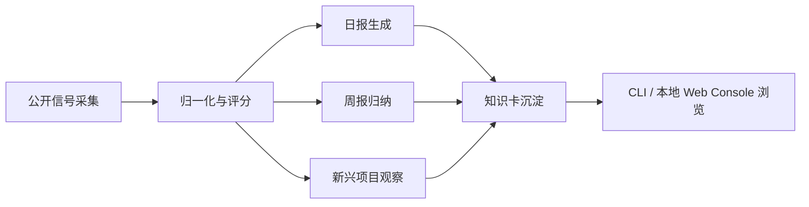

# AgentRadar

面向 AI Agent 生态的开源趋势雷达与研究工作台。

[English](./README.en.md) · 中文


> 从公开信号里抓变化，从周级趋势里看方向，从可复用产物里做研究。

---

## 这是什么

AgentRadar 会持续采集 AI Agent 生态里的公开信号，做归一化、评分、周趋势归纳、知识卡沉淀和新兴项目观察，最后把结果整理成一套本地可浏览、可验证、可复用的研究产物。

你可以把它理解成一套开源版的 Agent 生态雷达系统，适合研究者、开发者、投资人、产品团队和 Agent Builder：

- 它不是聊天机器人，而是一条可重复运行的数据与分析流水线。
- 它不是黑盒推荐，而是尽量保留证据链、评分拆解和趋势判断依据。
- 它不只看单日热度，也看持续性、周级移动和新方向浮现。

如果你经常会问这些问题，这个项目就是为你准备的：

- 今天有哪些 Agent 项目值得看？
- 哪些仓库只是一日热度，哪些在持续抬头？
- 本周真正成形的趋势方向是什么？
- 哪些还没进主榜的新项目值得提前盯住？
- 某个项目为什么排得高，背后的证据是什么？

## 为什么值得关注

很多项目都能抓一次 `GitHub Trending`，但真正困难的是后半段：

- 怎么把不同来源的信号对齐成同一种语言？
- 怎么同时看当天热度和长期持续性？
- 怎么把“感觉很火”变成可解释、可复核的趋势判断？
- 怎么在项目爆发前，就把它放进观察池？

AgentRadar 把这些步骤连成一套完整工作流，并把结果沉淀成每天、每周都能复查的产物，而不是停在一句主观判断上。

## 你能得到什么

### 1. 每日趋势主榜

- `data/reports/YYYY-MM-DD.daily.json`
- `data/reports/YYYY-MM-DD.daily.md`
- `data/reports/YYYY-MM-DD.run-summary.json`
- `data/reports/YYYY-MM-DD.verify-daily.json`

### 2. 每周趋势归纳

- `data/reports/YYYY-MM-DD.weekly.json`
- `data/reports/YYYY-MM-DD.weekly.md`
- `data/reports/YYYY-MM-DD.weekly.judgment.json`
- `data/reports/YYYY-MM-DD.weekly.audit.json`

### 3. 项目知识卡

- `data/kb/latest.json`
- `data/kb/*.md`

### 4. 新兴项目观察池

- `data/observer/ecosystem-focus/*.json`

### 5. 本地只读工作台

开源版自带一个轻量本地 Web Console，用来浏览已生成产物，但不包含登录、注册、会话和账号系统。

## 工作流一眼看懂



这条路径通常会把原始信号从 `data/raw/` 一路推进到 `data/scores/`、`data/reports/`、`data/observer/` 和 `data/kb/`，因此它既能做本地研究工具，也能做稳定的产物生成器。

## 适合谁使用

- 想持续追踪 Agent 生态变化的研究者
- 想做项目观察、方向判断和竞品扫描的开发者或产品团队
- 想把公开信号沉淀成结构化产物的情报工作流搭建者
- 想基于现有规则和数据源，扩展自己的内部趋势雷达的人

## 快速开始

### 1. 安装依赖

```bash
corepack pnpm install
```

### 2. 准备环境变量

```bash
cp .env.example .env
```

说明：

- 如果你只是浏览已提交产物，通常不需要补任何 provider key。
- 如果你想运行带 LLM 增强的流程，再按需补充相关 key。

### 3. 启动本地 Web Console

```bash
corepack pnpm visual-console:web
```

默认地址：

- `http://127.0.0.1:3210`

### 4. 直接看 CLI 视图

```bash
corepack pnpm visual-console -- --view overview --date latest
```

## 常用命令

### 每日流程

```bash
corepack pnpm run-daily
corepack pnpm verify-daily
corepack pnpm score
```

### 每周流程

```bash
corepack pnpm run-weekly
corepack pnpm sync-weekly
```

### 其他

```bash
corepack pnpm capture-github-stars
corepack pnpm build-kb
corepack pnpm typecheck
corepack pnpm test
```

## 数据与边界

### 当前重点观察方向

- coding agents
- agent runtime
- skills / tools / MCP
- memory / knowledge
- browser / computer use
- eval / observability / governance
- multi-agent coordination
- agent UI / workbench

这些方向来自仓库规则与配置，不是写死在 prompt 里的模糊判断。

### 开源版边界

为了避免暴露配置、密钥和私有攻击面，当前开源版明确不包含：

- 登录
- 注册
- OAuth
- session / account settings
- 本地 auth bootstrap
- 私有部署模板
- 私有运维文档
- `.env` / `.env.local`

换句话说，开源版是一个无登录、只读浏览、可运行数据工作流的公开版本。

## 致谢与贡献

这个项目高度受益于开源社区和公开数据源，特别感谢：

- [agents-radar](https://github.com/duanyytop/agents-radar)
- [Trendshift](https://trendshift.io)
- [GitHub](https://github.com)
- 更广泛的 Agent 开源构建者与维护者

如果这些上游项目和生态对你有帮助，也欢迎顺手给它们一个 Star。

### 贡献方式

- 提 Issue 反馈 bug
- 提 PR 改进 README、规则、数据源和工作流
- 提出你希望新增的观察方向或指标

如果 AgentRadar 对你有帮助，也欢迎给这个仓库点一个 Star，并分享给同样在关注 Agent 生态、趋势研究和开源情报工作流的朋友。
